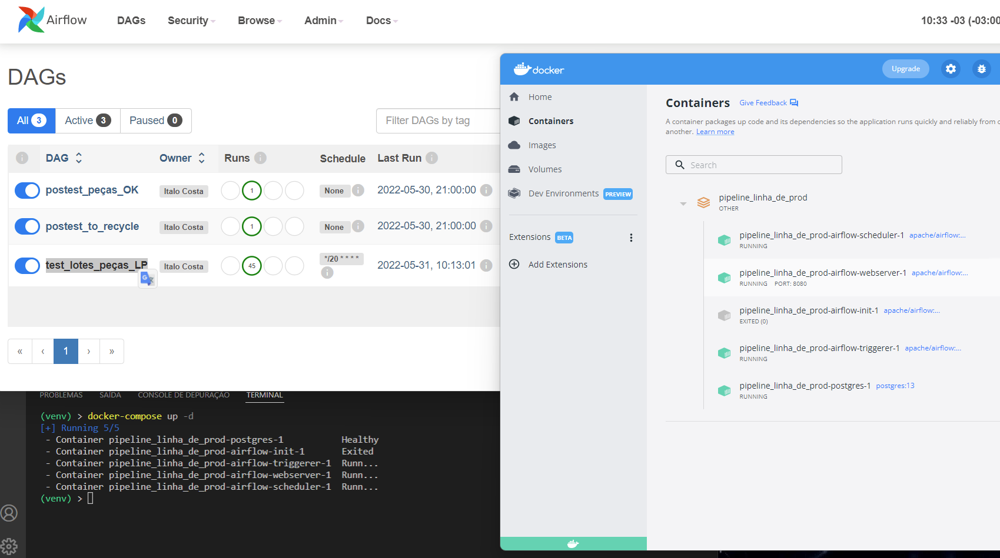

# Docker Compose - Airflow

Exemplo de orquestração de pipelines em python utilizando:

* Docker Desktop
* Python + lib apache-aiflow

Para rodar este exemplo:
- iniciar docker desktop
- salve todos os scripts e diretórios existentes como está neste repositório
- na raiz deste diretório execute o comando:
    + docker-compose up -d
- aguarde a inicialização do airflow e acesse http://localhost:8080
    + login: airflow
    + senha: airflow
- ative as 3 DAGs
- execute a DAG test_lotes_peças_LP

Importante:
- não há dados de lotes de peças, somente um exemplo estrutural. Substitua esses exemplos em uma coleta API de dados
- neste exemplo, para amplicar o conhecimento, foram utilizadas 3 dags: 
    + a dag principal test_lotes_peças_LP e 
    + as dags reservas (como triggers)
        + postest_peças_OK, simulando uma dag que executa o processo de produção, estoque e logística
        + postest_to_recycle, simulando erro na embalagem e descarte de peças para reciclagem.
- utilizar os operators PyThonOperator, BranchPythonOperator e TriggerDagRunOperator

Ótimo aprendizado!!!
